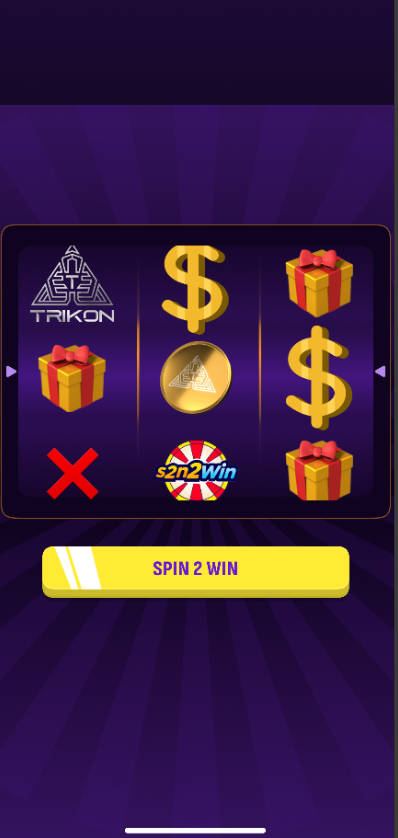

# Slot Game - Development in Progress

Welcome to the development repository for the **Slot Game**, a simple yet exciting 3x3 slot machine game designed for testing and experimentation. This project is a work in progress, and many features are actively being developed and refined.

---

## Features (Implemented and Upcoming)

### ✅ Currently Implemented:
- **3x3 Reel Layout**: A classic slot machine grid with 3 rows and 3 columns.
- **Symbols**: Symbols have been chosen from publicly available resources on the internet to bring life to the reels.

### 🔄 Upcoming Features:
- **Winning Logic**: Implementation of win conditions to determine payouts based on symbol combinations.
- **Cool Animations**: Eye-catching animations for spinning reels, winning sequences, and special effects.
- **Enhanced User Experience**: Polished UI elements, sounds, and interactivity to make the game more engaging.

---

## How to Play (Current State)
1. Clone this repository.
2. Open the project in your preferred development environment.
3. Run the project locally to see the 3x3 reel and symbols in action.
4. Spin the reels (future feature) and experience the evolving development process.

---

## Technology Stack
- **PixiJS**: For rendering and animations.
- **TypeScript**: To ensure robust and type-safe code.
- **GSAP**: (Planned) For smooth and dynamic animations.

---

## Development Progress
- The project is in its early stages, focusing on establishing the core mechanics.
- Upcoming updates will introduce gameplay elements, winning logic, and visual effects.

---

## Contributing
As this project is primarily for testing and personal experimentation, contributions are currently not open. However, feedback and suggestions are welcome! Feel free to open an issue or share your thoughts.

----

## Game Link

- You can try the game here: [Game Link](https://slot-game-test.vercel.app/)

---

## Screenshots
Here’s a glimpse of the 3x3 reel layout:

---

## Acknowledgments
- Symbols sourced from free and publicly available online resources.
- Thanks to the open-source community for the tools and libraries powering this project.

---

## License
This project is for testing purposes and is not intended for commercial use. All assets used are for development and testing only. Ensure proper licensing if reusing or modifying this project.

---

Stay tuned for updates and enjoy the journey of building a slot game!

